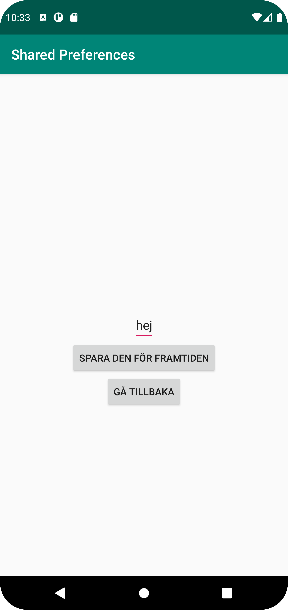

# Rapport

**Skriv din rapport här!**

Jag började med att deklarera alla variabler i MainActivity. Den viktiga för denna uppgift var SharedPreferences. I layout-filen för denna activity, som är activity_main.xml så hade jag skapat en textview och en knapp. Dessa hittade jag med hjälp av findviewbyid. Jag satte även en onClickListener på knappen med intent för att komma till en annan activity. I den andra activity så hade jag skapat en edittext och två knappar. Den ena knappen sparade datan som blev inmatad och den andra tar användaren tillbaka till den föregågna activity.

```
        button.setOnClickListener(new View.OnClickListener() {
            @Override
            public void onClick(View v) {
                SharedPreferences.Editor editor = preferences.edit();
                editor.putString("name", namn.getText().toString());
                editor.apply();
            }
        });
```

Koden ovanför är skriven i SecondActivity. Den tar texten som är inmatad med hjälp av getText.

```
    @Override
    protected void onResume() {
        super.onResume();
        String name = preferences.getString("name", "inget namn hittades");
        text.setText(name);
    }
```
Denna kod är skriven i MainActivity. Den tar emot den inmatade texten och skriver ut den





